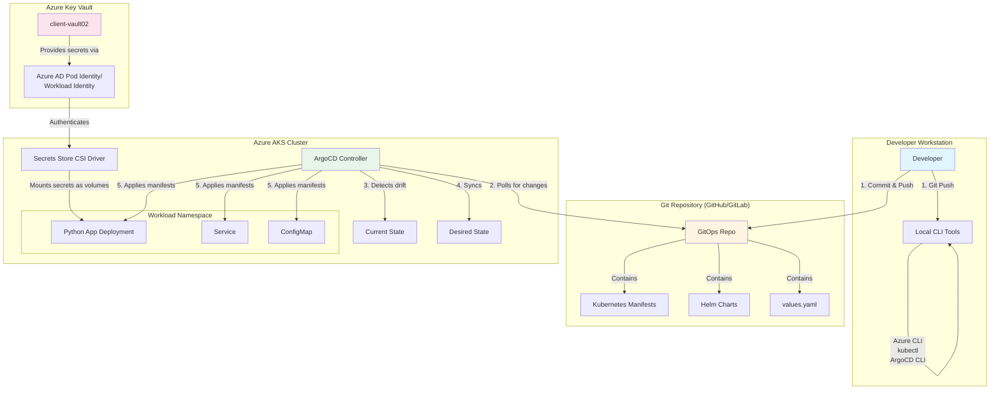

# Comprehensive GitOps Guide: ArgoCD on Azure AKS

## Table of Contents
- [Introduction](#introduction)
- [Architecture Overview](#architecture-overview)
- [Environment Details](#environment-details)
- [Local Environment Setup](#local-environment-setup)
- [Infrastructure Pre-requisites](#infrastructure-pre-requisites)
- [GitOps Repository Structure](#gitops-repository-structure)
- [Azure Key Vault Integration](#azure-key-vault-integration)
- [ArgoCD Installation](#argocd-installation)
- [Application Deployment](#application-deployment)
- [Best Practices & Troubleshooting](#best-practices--troubleshooting)

---

## Introduction

This guide provides a comprehensive walkthrough for implementing a **GitOps workflow** using **ArgoCD** on **Azure Kubernetes Service (AKS)**. GitOps is a paradigm that uses Git repositories as the single source of truth for declarative infrastructure and applications. ArgoCD automates the deployment of the desired application states in the specified target environments.

### What You'll Learn
- How to set up ArgoCD on an existing AKS cluster
- How to integrate Azure Key Vault with AKS for secure secret management
- How to structure a GitOps repository for multi-environment deployments
- How to deploy applications using ArgoCD (both GUI and declarative approaches)
- Best practices for managing configurations and secrets in a GitOps workflow

### Prerequisites
- Basic understanding of Kubernetes concepts
- Familiarity with Azure services
- Access to the Azure subscription and AKS cluster specified below
- Git version control knowledge

---

## Architecture Overview

### High-Level Architecture (Mermaid Diagram)



### ASCII Architecture Flow

```
┌─────────────────────────────────────────────────────────────────────┐
│                        LOCAL DEVELOPMENT                             │
│  ┌──────────────┐         ┌──────────────┐                          │
│  │ Developer    │────────▶│  Git Commit  │                          │
│  │ Workstation  │         │  & Push      │                          │
│  └──────────────┘         └──────┬───────┘                          │
│         │                         │                                  │
│         │ Tools: Azure CLI,       │                                  │
│         │ kubectl, ArgoCD CLI     │                                  │
└─────────┼─────────────────────────┼──────────────────────────────────┘
          │                         │
          │                         ▼
┌─────────┼──────────────────────────────────────────────────────────┐
│         │              GIT REPOSITORY (GitHub/GitLab)               │
│         │      ┌───────────────────────────────────────┐            │
│         └─────▶│  GitOps Repository                    │            │
│                │  ├── apps/                            │            │
│                │  │   ├── python-app/                  │            │
│                │  │       ├── base/                    │            │
│                │  │       ├── overlays/                │            │
│                │  ├── infrastructure/                  │            │
│                │  └── argocd-apps/                     │            │
│                └───────────────┬───────────────────────┘            │
└────────────────────────────────┼──────────────────────────────────┘
                                 │
                                 │ (2) ArgoCD polls every 3 min
                                 │     or webhook triggers
                                 ▼
┌─────────────────────────────────────────────────────────────────────┐
│                    AZURE AKS CLUSTER                                 │
│                    (eventdriven-aks)                                 │
│                                                                      │
│  ┌────────────────────────────────────────────────────────────┐    │
│  │              ArgoCD Namespace                              │    │
│  │  ┌──────────────────────────────────────┐                  │    │
│  │  │  ArgoCD Application Controller       │                  │    │
│  │  │  ├─ Monitors Git Repo                │                  │    │
│  │  │  ├─ Compares Desired vs Current      │◀─────┐               │
│  │  │  ├─ Auto-sync (if enabled)           │      │           │    │
│  │  │  └─ Applies manifests to cluster     │      │           │    │
│  │  └──────────────┬───────────────────────┘      │           │    │
│  └─────────────────┼──────────────────────────────┼───────────┘    │
│                    │                              │                │
│                    │ (3) Deploys manifests        │                │
│                    ▼                              │                │
│  ┌─────────────────────────────────────────────┐ │                │
│  │       Application Namespace (python-app)     │ │                │
│  │  ┌────────────────────────────────────────┐ │ │                │
│  │  │  Deployment: python-app                │ │ │                │
│  │  │  ├─ Pod: python-app-xyz                │ │ │                │
│  │  │  │   ├─ Container: python-app          │ │ │                │
│  │  │  │   └─ Volume: secrets-store-inline   │─┼─┘                │
│  │  │  │                                      │ │                  │
│  │  │  Service: python-app-service           │ │                  │
│  │  │  ConfigMap: python-app-config          │ │                  │
│  │  └────────────────────────────────────────┘ │                  │
│  │                                              │                  │
│  │  ┌────────────────────────────────────────┐ │                  │
│  │  │  Secrets Store CSI Driver              │ │                  │
│  │  │  (Mounts Azure Key Vault secrets)      │ │                  │
│  │  └──────────────┬─────────────────────────┘ │                  │
│  └─────────────────┼───────────────────────────┘                  │
│                    │                                               │
│                    │ (4) Authenticates & fetches secrets           │
│                    │     via Workload Identity/Pod Identity        │
└────────────────────┼───────────────────────────────────────────────┘
                     │
                     ▼
┌─────────────────────────────────────────────────────────────────────┐
│                    AZURE KEY VAULT                                   │
│                    (client-vault02)                                  │
│                    Resource Group: client-rg                         │
│                                                                      │
│  Secrets:                                                            │
│  ├─ database-connection-string                                      │
│  ├─ api-key                                                          │
│  └─ service-credentials                                              │
│                                                                      │
└─────────────────────────────────────────────────────────────────────┘
```

### Workflow Explanation

1. **Developer Commits**: Developer makes changes to application code or Kubernetes manifests and pushes to Git repository
2. **ArgoCD Polls**: ArgoCD controller polls the Git repository every 3 minutes (configurable) or receives webhook notifications
3. **Drift Detection**: ArgoCD compares the desired state (Git) with the current state (cluster)
4. **Automatic Sync**: If auto-sync is enabled, ArgoCD automatically applies changes to the cluster
5. **Secret Injection**: Secrets Store CSI Driver fetches secrets from Azure Key Vault and mounts them into pods
6. **Application Runs**: The application runs with configurations from ConfigMaps and secrets from Key Vault

---

## Environment Details

### Azure Subscription Information
```yaml
Subscription Name: MCAPS-Hybrid-REQ-38781-2022-ashis
Subscription ID: bcd3f168-e1c6-43ad-a206-afde31f16509
Region: East US 2
```

### Resource Details
```yaml
Resource Group: eventdriven-ai-dev-rg
AKS Cluster Name: eventdriven-aks
Key Vault Name: client-vault02
Key Vault Resource Group: client-rg
```

### Tagging Requirements
**IMPORTANT**: All new resources created must include the following tag:
```yaml
Security: Ignore
```

This tag is used for compliance and security scanning purposes within the organization.

---

## Local Environment Setup

### Overview
Before working with ArgoCD and AKS, you need to install several tools on your local machine. This section provides installation instructions for Windows (PowerShell).

### 1. Azure CLI

**Purpose**: The Azure CLI allows you to manage Azure resources from the command line, including authentication, AKS cluster management, and Key Vault operations.

#### Installation

```powershell
# Download and install Azure CLI using the MSI installer
# Visit: https://aka.ms/installazurecliwindows
# Or install via winget
winget install -e --id Microsoft.AzureCLI
```

#### Verification

```powershell
# Check Azure CLI version (should be 2.x or higher)
az --version

# Login to Azure
az login

# Set your subscription context
az account set --subscription "bcd3f168-e1c6-43ad-a206-afde31f16509"

# Verify you're using the correct subscription
az account show --output table
```

---

### 2. Kubectl

**Purpose**: kubectl is the Kubernetes command-line tool that allows you to run commands against Kubernetes clusters. You'll use it to deploy applications, inspect cluster resources, and view logs.

#### Installation

```powershell
# Install kubectl using Azure CLI (recommended for AKS)
az aks install-cli

# Alternatively, install via winget
winget install -e --id Kubernetes.kubectl
```

#### Configuration

```powershell
# Get AKS cluster credentials and merge into your kubeconfig
# This command configures kubectl to connect to your AKS cluster
az aks get-credentials `
    --resource-group eventdriven-ai-dev-rg `
    --name eventdriven-aks `
    --overwrite-existing

# Verify connection to cluster
kubectl cluster-info

# Check nodes in your cluster
kubectl get nodes

# View current context
kubectl config current-context
```

#### Understanding kubeconfig

The `az aks get-credentials` command does the following:
- Downloads cluster credentials from Azure
- Creates/updates `~/.kube/config` file
- Sets up authentication using Azure AD (if enabled) or cluster certificates
- Configures the cluster endpoint and certificate authority data

---

### 3. ArgoCD CLI

**Purpose**: The ArgoCD CLI provides a command-line interface for managing ArgoCD applications, projects, and settings. While ArgoCD has a web UI, the CLI is essential for automation and CI/CD pipelines.

#### Installation

```powershell
# Download the latest ArgoCD CLI for Windows
# Visit: https://github.com/argoproj/argo-cd/releases/latest

# Using PowerShell to download (replace VERSION with latest, e.g., v2.9.3)
$version = "v2.12.3"
$url = "https://github.com/argoproj/argo-cd/releases/download/$version/argocd-windows-amd64.exe"
$output = "$env:USERPROFILE\bin\argocd.exe"

# Create bin directory if it doesn't exist
New-Item -ItemType Directory -Force -Path "$env:USERPROFILE\bin"

# Download ArgoCD CLI
Invoke-WebRequest -Uri $url -OutFile $output

# Add to PATH (add this to your PowerShell profile for persistence)
$env:PATH += ";$env:USERPROFILE\bin"
```

#### Add to PATH Permanently

```powershell
# Add to user PATH environment variable permanently
[Environment]::SetEnvironmentVariable(
    "Path",
    [Environment]::GetEnvironmentVariable("Path", "User") + ";$env:USERPROFILE\bin",
    "User"
)
```

#### Verification

```powershell
# Check ArgoCD CLI version
argocd version --client

# Expected output: argocd: v2.x.x+...
argocd: v2.12.3+6b9cd82
  BuildDate: 2024-08-27T12:18:06Z
  GitCommit: 6b9cd828c6e9807398869ad5ac44efd2c28422d6
  GitTreeState: clean
  GoVersion: go1.22.6
  Compiler: gc
  Platform: windows/amd64
```

---

### 4. Helm

**Purpose**: Helm is a package manager for Kubernetes that helps you define, install, and upgrade complex Kubernetes applications. We'll use it to install ArgoCD and manage application deployments.

#### Installation

```powershell
# Install Helm using winget
winget install Helm.Helm

# Alternatively, download from https://github.com/helm/helm/releases
# Or use Chocolatey
choco install kubernetes-helm
```

#### Verification

```powershell
# Check Helm version (should be 3.x or higher)
helm version

# Add common Helm repositories
helm repo add stable https://charts.helm.sh/stable
helm repo add argo https://argoproj.github.io/argo-helm

# Update Helm repositories
helm repo update

# List installed repositories
helm repo list
```

---

### 5. Git (Optional but Recommended)

**Purpose**: Git is essential for version control and managing your GitOps repository.

#### Installation

```powershell
# Install Git using winget
winget install -e --id Git.Git
```

#### Verification

```powershell
# Check Git version
git --version

# Configure Git (if not already done)
git config --global user.name "Your Name"
git config --global user.email "your.email@example.com"
```

---

### Tool Installation Summary

After completing the installation steps above, verify all tools are installed correctly:

```powershell
# Run this comprehensive verification script
Write-Host "=== Environment Verification ===" -ForegroundColor Cyan

Write-Host "`nAzure CLI:" -ForegroundColor Yellow
az --version | Select-String "azure-cli"

Write-Host "`nKubectl:" -ForegroundColor Yellow
kubectl version --client --short 2>$null

Write-Host "`nArgoCD CLI:" -ForegroundColor Yellow
argocd version --client 2>$null | Select-String "argocd:"

Write-Host "`nHelm:" -ForegroundColor Yellow
helm version --short

Write-Host "`nGit:" -ForegroundColor Yellow
git --version

Write-Host "`nCurrent Kubernetes Context:" -ForegroundColor Yellow
kubectl config current-context

Write-Host "`n=== Verification Complete ===" -ForegroundColor Green
```

---

## Infrastructure Pre-requisites

### Overview
Before installing ArgoCD, ensure your AKS cluster meets the necessary requirements and is properly configured.

### 1. Verify AKS Cluster Status

```powershell
# Check if AKS cluster is running
az aks show `
    --resource-group eventdriven-ai-dev-rg `
    --name eventdriven-aks `
    --query "powerState.code" `
    --output tsv

# Expected output: Running

# Get cluster details
az aks show `
    --resource-group eventdriven-ai-dev-rg `
    --name eventdriven-aks `
    --output table
```

### 2. Verify Cluster Connectivity

```powershell
# Test connectivity to the cluster
kubectl get nodes

# Check cluster version
kubectl version

# View cluster namespaces
kubectl get namespaces
```

### 3. Create Namespace for ArgoCD

```powershell
# Create a dedicated namespace for ArgoCD
# Namespaces provide logical isolation within a cluster
kubectl create namespace argocd

# Verify namespace creation
kubectl get namespace argocd
```

### 4. Enable Monitoring (Optional but Recommended)

```powershell
# Enable Azure Monitor for containers if not already enabled
# This provides insights into cluster and application performance
az aks enable-addons `
    --resource-group eventdriven-ai-dev-rg `
    --name eventdriven-aks `
    --addons monitoring `
    --workspace-resource-id "/subscriptions/bcd3f168-e1c6-43ad-a206-afde31f16509/resourceGroups/eventdriven-ai-dev-rg/providers/Microsoft.OperationalInsights/workspaces/eventdriven-logs"

# Note: Adjust workspace-resource-id to match your Log Analytics workspace
# Or create a new workspace if one doesn't exist
```

---

## GitOps Repository Structure

### Overview
A well-organized GitOps repository is crucial for maintainability and scalability. This structure follows Kubernetes best practices and supports multiple environments.

### Recommended Directory Structure

```
gitops-repo/
├── README.md                           # Repository documentation
├── .gitignore                          # Git ignore rules
│
├── apps/                               # Application definitions
│   ├── python-app/                     # Sample Python application
│   │   ├── base/                       # Base Kubernetes manifests (environment-agnostic)
│   │   │   ├── kustomization.yaml      # Kustomize base configuration
│   │   │   ├── deployment.yaml         # Deployment manifest
│   │   │   ├── service.yaml            # Service manifest
│   │   │   ├── configmap.yaml          # ConfigMap for app configuration
│   │   │   └── secretproviderclass.yaml # Azure Key Vault secret mapping
│   │   │
│   │   └── overlays/                   # Environment-specific overrides
│   │       ├── dev/                    # Development environment
│   │       │   ├── kustomization.yaml  # Dev-specific patches
│   │       │   └── values.yaml         # Dev configuration values
│   │       │
│   │       ├── staging/                # Staging environment
│   │       │   ├── kustomization.yaml
│   │       │   └── values.yaml
│   │       │
│   │       └── prod/                   # Production environment
│   │           ├── kustomization.yaml
│   │           └── values.yaml
│   │
│   └── another-app/                    # Additional applications follow same structure
│       ├── base/
│       └── overlays/
│
├── infrastructure/                     # Infrastructure components
│   ├── namespaces/                     # Namespace definitions
│   │   ├── dev.yaml
│   │   ├── staging.yaml
│   │   └── prod.yaml
│   │
│   ├── ingress/                        # Ingress controllers and rules
│   │   ├── nginx-ingress/
│   │   └── certificates/
│   │
│   ├── monitoring/                     # Monitoring stack
│   │   ├── prometheus/
│   │   └── grafana/
│   │
│   └── secrets-management/             # Secrets infrastructure
│       ├── csi-driver/                 # Secrets Store CSI Driver
│       └── external-secrets/           # External Secrets Operator (alternative)
│
├── argocd-apps/                        # ArgoCD Application definitions
│   ├── python-app-dev.yaml             # ArgoCD App for python-app in dev
│   ├── python-app-staging.yaml         # ArgoCD App for python-app in staging
│   ├── python-app-prod.yaml            # ArgoCD App for python-app in prod
│   └── app-of-apps.yaml                # App of Apps pattern (manages other apps)
│
└── scripts/                            # Helper scripts
    ├── setup-argocd.sh                 # ArgoCD installation script
    └── sync-apps.sh                    # Bulk sync script
```

### Why This Structure?

1. **Separation of Concerns**
   - `apps/` contains application-specific manifests
   - `infrastructure/` contains cluster-wide infrastructure components
   - `argocd-apps/` contains ArgoCD Application definitions (meta-layer)

2. **Environment Management**
   - `base/` contains common configurations shared across all environments
   - `overlays/` contains environment-specific customizations
   - This follows the Kustomize pattern for DRY (Don't Repeat Yourself) principles

3. **Scalability**
   - Easy to add new applications or environments
   - Clear organization makes it easy for teams to find what they need
   - Supports the "App of Apps" pattern for managing multiple applications

4. **GitOps Best Practices**
   - All infrastructure and applications are defined as code
   - Changes are tracked in Git history
   - Pull requests provide review and approval process

### Key Concepts

**Kustomize**: A tool built into kubectl that lets you customize Kubernetes manifests without modifying the original files. It uses overlays to patch base configurations.

**Base vs Overlays**: 
- **Base**: Common configuration shared across all environments
- **Overlays**: Environment-specific patches (e.g., different replica counts, resource limits)

**App of Apps Pattern**: An ArgoCD application that manages other ArgoCD applications. This is useful for:
- Bootstrapping an entire environment
- Managing related applications as a group
- Simplifying bulk operations

---

## Azure Key Vault Integration

### Overview
Azure Key Vault integration with AKS allows your applications to securely access secrets without hardcoding them in manifests or images. We'll use the **Secrets Store CSI Driver** with the **Azure Key Vault Provider**.

### Architecture Flow

```
┌─────────────────────┐
│  Azure Key Vault    │
│  (client-vault02)   │
│                     │
│  Secrets:           │
│  - db-password      │
│  - api-key          │
│  - certificate      │
└──────────┬──────────┘
           │
           │ Azure AD Authentication
           │ (Workload Identity or Pod Identity)
           │
┌──────────▼──────────┐
│ Secrets Store       │
│ CSI Driver          │
│ (DaemonSet)         │
└──────────┬──────────┘
           │
           │ Mounts secrets as volume
           │
┌──────────▼──────────┐
│ Application Pod     │
│                     │
│ Volumes:            │
│ - secrets-store     │
│   /mnt/secrets/     │
│   - db-password     │
│   - api-key         │
└─────────────────────┘
```

### Step 1: Enable Secrets Store CSI Driver on AKS

```powershell
# Enable the Secrets Store CSI Driver add-on
# This installs the CSI driver as a DaemonSet on all nodes
az aks enable-addons `
    --resource-group eventdriven-ai-dev-rg `
    --name eventdriven-aks `
    --addons azure-keyvault-secrets-provider `
    --enable-secret-rotation

# Verify the add-on is enabled
az aks show `
    --resource-group eventdriven-ai-dev-rg `
    --name eventdriven-aks `
    --query "addonProfiles.azureKeyvaultSecretsProvider" `
    --output table
```

**What this does**:
- Installs the Secrets Store CSI Driver on every node in the cluster
- Enables automatic secret rotation (secrets are refreshed periodically)
- Installs the Azure Key Vault provider for the CSI driver

### Step 2: Enable Workload Identity (Recommended Method)

**Workload Identity** is the modern, secure way to authenticate from AKS to Azure services. It uses Azure AD (Entra ID) and is more secure than Pod Identity.

```powershell
# Enable Workload Identity on the AKS cluster
az aks update `
    --resource-group eventdriven-ai-dev-rg `
    --name eventdriven-aks `
    --enable-oidc-issuer `
    --enable-workload-identity

# Get the OIDC issuer URL (needed for federated credentials)
$OIDC_ISSUER = az aks show `
    --resource-group eventdriven-ai-dev-rg `
    --name eventdriven-aks `
    --query "oidcIssuerProfile.issuerUrl" `
    --output tsv

Write-Host "OIDC Issuer URL: $OIDC_ISSUER" -ForegroundColor Green
```

### Step 3: Create Managed Identity for Workload

```powershell
# Create a managed identity for the application
# This identity will be used by the pod to authenticate to Key Vault
az identity create `
    --resource-group eventdriven-ai-dev-rg `
    --name python-app-identity `
    --location eastus2 `
    --tags Security=Ignore

# Get the identity details
$IDENTITY_CLIENT_ID = az identity show `
    --resource-group eventdriven-ai-dev-rg `
    --name python-app-identity `
    --query "clientId" `
    --output tsv

$IDENTITY_OBJECT_ID = az identity show `
    --resource-group eventdriven-ai-dev-rg `
    --name python-app-identity `
    --query "principalId" `
    --output tsv

Write-Host "Identity Client ID: $IDENTITY_CLIENT_ID" -ForegroundColor Green
Write-Host "Identity Object ID: $IDENTITY_OBJECT_ID" -ForegroundColor Green
```

### Step 4: Grant Key Vault Access to Managed Identity

```powershell
# Grant the managed identity access to Key Vault secrets
# This uses Azure RBAC for Key Vault (recommended over access policies)

# First, ensure the Key Vault is using Azure RBAC
az keyvault update `
    --name client-vault02 `
    --resource-group client-rg `
    --enable-rbac-authorization true

# Assign "Key Vault Secrets User" role to the managed identity
# This allows the identity to read secret values
az role assignment create `
    --role "Key Vault Secrets User" `
    --assignee-object-id $IDENTITY_OBJECT_ID `
    --assignee-principal-type ServicePrincipal `
    --scope "/subscriptions/bcd3f168-e1c6-43ad-a206-afde31f16509/resourceGroups/client-rg/providers/Microsoft.KeyVault/vaults/client-vault02"

# Verify the role assignment
az role assignment list `
    --assignee $IDENTITY_OBJECT_ID `
    --scope "/subscriptions/bcd3f168-e1c6-43ad-a206-afde31f16509/resourceGroups/client-rg/providers/Microsoft.KeyVault/vaults/client-vault02" `
    --output table
```

### Step 5: Create Federated Identity Credential

```powershell
# Create a federated identity credential
# This links the Azure AD identity to a Kubernetes service account
# The pod must use this service account to authenticate

# First, get the OIDC issuer if not already retrieved
$OIDC_ISSUER = az aks show `
    --resource-group eventdriven-ai-dev-rg `
    --name eventdriven-aks `
    --query "oidcIssuerProfile.issuerUrl" `
    --output tsv

# Create federated credential
# This allows pods in the "python-app" namespace using the "python-app-sa" service account
# to authenticate as this managed identity
az identity federated-credential create `
    --name python-app-federated-credential `
    --identity-name python-app-identity `
    --resource-group eventdriven-ai-dev-rg `
    --issuer $OIDC_ISSUER `
    --subject "system:serviceaccount:python-app:python-app-sa"

# Verify the federated credential
az identity federated-credential show `
    --name python-app-federated-credential `
    --identity-name python-app-identity `
    --resource-group eventdriven-ai-dev-rg `
    --output table
```

**Understanding Federated Credentials**:
- **Issuer**: The OIDC issuer URL of your AKS cluster
- **Subject**: The Kubernetes service account in the format `system:serviceaccount:<namespace>:<serviceaccount-name>`
- **Purpose**: Establishes trust between Kubernetes and Azure AD

### Step 6: Create Kubernetes Service Account

```powershell
# Create the namespace for the application
kubectl create namespace python-app

# Create a Kubernetes service account with annotations linking it to the Azure identity
# Save this to a file for GitOps repository
```

Create file: `apps/python-app/base/serviceaccount.yaml`

```yaml
apiVersion: v1
kind: ServiceAccount
metadata:
  name: python-app-sa
  namespace: python-app
  annotations:
    # This annotation links the Kubernetes service account to the Azure managed identity
    # The CSI driver and Workload Identity use this to authenticate to Azure
    azure.workload.identity/client-id: "<IDENTITY_CLIENT_ID>"
  labels:
    # Label required for Workload Identity webhook to inject identity
    azure.workload.identity/use: "true"
```

Apply the service account:

```powershell
# Replace <IDENTITY_CLIENT_ID> with the actual client ID
# Or use envsubst/sed to substitute the value

kubectl apply -f apps/python-app/base/serviceaccount.yaml
```

### Step 7: Create SecretProviderClass

The **SecretProviderClass** is a custom resource that tells the CSI driver:
- Which Key Vault to connect to
- Which secrets to fetch
- How to present them in the pod (files, Kubernetes secrets, or both)

Create file: `apps/python-app/base/secretproviderclass.yaml`

```yaml
apiVersion: secrets-store.csi.x-k8s.io/v1
kind: SecretProviderClass
metadata:
  name: azure-keyvault-python-app
  namespace: python-app
spec:
  # Provider specifies which CSI driver provider to use (Azure Key Vault)
  provider: azure
  
  parameters:
    # Use Workload Identity for authentication (recommended)
    usePodIdentity: "false"
    useVMManagedIdentity: "false"
    
    # The client ID of the managed identity that has access to Key Vault
    # This must match the service account annotation
    clientID: "<IDENTITY_CLIENT_ID>"
    
    # The name of the Azure Key Vault
    keyvaultName: "client-vault02"
    
    # Tenant ID for Azure AD
    tenantId: "<TENANT_ID>"
    
    # Objects to retrieve from Key Vault
    # This is a YAML array serialized as a string
    objects: |
      array:
        - |
          objectName: database-connection-string
          objectType: secret
          objectAlias: db-connection-string
        - |
          objectName: api-key
          objectType: secret
          objectAlias: api-key
        - |
          objectName: app-certificate
          objectType: secret
          objectAlias: app-cert
  
  # Optional: Create Kubernetes secrets from Key Vault secrets
  # This allows you to reference secrets as env vars using secretKeyRef
  secretObjects:
    - secretName: python-app-secrets
      type: Opaque
      data:
        - objectName: db-connection-string
          key: DATABASE_URL
        - objectName: api-key
          key: API_KEY
```

**Key Parameters Explained**:
- `usePodIdentity`: Set to `false` when using Workload Identity
- `clientID`: The client ID of the managed identity
- `keyvaultName`: The name of your Azure Key Vault
- `objects`: List of secrets/keys/certificates to retrieve
- `objectAlias`: The filename when mounted in the pod
- `secretObjects`: Optional - creates Kubernetes secrets from Key Vault secrets

Apply the SecretProviderClass:

```powershell
kubectl apply -f apps/python-app/base/secretproviderclass.yaml
```

### Step 8: Verify Key Vault Access

```powershell
# Verify that secrets exist in Key Vault
az keyvault secret list `
    --vault-name client-vault02 `
    --query "[].name" `
    --output table

# If secrets don't exist, create sample secrets for testing
az keyvault secret set `
    --vault-name client-vault02 `
    --name database-connection-string `
    --value "Server=myserver.database.windows.net;Database=mydb;User=admin;Password=P@ssw0rd!" `
    --tags Security=Ignore

az keyvault secret set `
    --vault-name client-vault02 `
    --name api-key `
    --value "sk_test_1234567890abcdef" `
    --tags Security=Ignore

az keyvault secret set `
    --vault-name client-vault02 `
    --name app-certificate `
    --value "-----BEGIN CERTIFICATE-----\nMIIC...base64...\n-----END CERTIFICATE-----" `
    --tags Security=Ignore
```

### Summary of Key Vault Integration

At this point, you have:
1. ✅ Enabled Secrets Store CSI Driver on AKS
2. ✅ Enabled Workload Identity for secure authentication
3. ✅ Created a managed identity with Key Vault access
4. ✅ Created federated credential linking Kubernetes to Azure AD
5. ✅ Created a Kubernetes service account with identity annotations
6. ✅ Created a SecretProviderClass to map Key Vault secrets to pod volumes

**Next Steps**: When deploying applications, you'll reference the SecretProviderClass in your pod spec to mount secrets.

---

## ArgoCD Installation

### Overview
ArgoCD is a declarative, GitOps continuous delivery tool for Kubernetes. This section covers installing ArgoCD on your AKS cluster and configuring initial access.

### Step 1: Install ArgoCD Using Kubectl

```powershell
# Ensure you're in the correct cluster context
kubectl config current-context

# Install ArgoCD in the argocd namespace
# This applies the official ArgoCD installation manifest
kubectl apply -n argocd -f https://raw.githubusercontent.com/argoproj/argo-cd/stable/manifests/install.yaml

# Wait for all ArgoCD pods to be ready (this may take 2-3 minutes)
kubectl wait --for=condition=Ready pods --all -n argocd --timeout=300s
```

**What gets installed**:
- `argocd-server`: Web UI and API server
- `argocd-repo-server`: Connects to Git repositories and generates manifests
- `argocd-application-controller`: Monitors applications and syncs desired state
- `argocd-dex-server`: Authentication (SSO/LDAP/SAML)
- `argocd-redis`: Cache for improved performance

### Step 2: Verify ArgoCD Installation

```powershell
# Check all pods in the argocd namespace
kubectl get pods -n argocd

# Expected output: All pods in Running state
# NAME                                  READY   STATUS    RESTARTS
# argocd-application-controller-0       1/1     Running   0
# argocd-dex-server-xxx                 1/1     Running   0
# argocd-redis-xxx                      1/1     Running   0
# argocd-repo-server-xxx                1/1     Running   0
# argocd-server-xxx                     1/1     Running   0

# Check services
kubectl get svc -n argocd

# You should see services including argocd-server
```

### Step 3: Expose ArgoCD Server

By default, the ArgoCD server is not exposed outside the cluster. You have several options:

#### Option A: Port Forwarding (Quick, for Testing)

```powershell
# Forward local port 8080 to the argocd-server service
# This creates a tunnel from localhost:8080 to the ArgoCD server
kubectl port-forward svc/argocd-server -n argocd 8080:443

# Keep this terminal open and access ArgoCD at:
# https://localhost:8080

# Note: You'll see a certificate warning (self-signed cert) - this is normal for testing
```

#### Option B: LoadBalancer Service (Exposes Public IP)

```powershell
# Change the argocd-server service to type LoadBalancer
# This provisions an Azure Load Balancer with a public IP
kubectl patch svc argocd-server -n argocd -p '{\"spec\": {\"type\": \"LoadBalancer\"}}'

# Wait for external IP to be assigned (takes 1-2 minutes)
kubectl get svc argocd-server -n argocd --watch

# Once EXTERNAL-IP shows an IP address (not <pending>), you can access ArgoCD at:
# https://<EXTERNAL-IP>
```

#### Option C: Ingress (Production Recommended)

For production, use an Ingress controller with TLS termination:

Create file: `infrastructure/ingress/argocd-ingress.yaml`

```yaml
apiVersion: networking.k8s.io/v1
kind: Ingress
metadata:
  name: argocd-server-ingress
  namespace: argocd
  annotations:
    # Use nginx ingress controller
    kubernetes.io/ingress.class: nginx
    
    # Enable SSL passthrough (ArgoCD handles TLS)
    nginx.ingress.kubernetes.io/ssl-passthrough: "true"
    
    # Backend protocol is HTTPS
    nginx.ingress.kubernetes.io/backend-protocol: "HTTPS"
    
    # Optional: Enable cert-manager for automatic TLS certificates
    # cert-manager.io/cluster-issuer: "letsencrypt-prod"
spec:
  rules:
    - host: argocd.yourdomain.com  # Replace with your domain
      http:
        paths:
          - path: /
            pathType: Prefix
            backend:
              service:
                name: argocd-server
                port:
                  number: 443
  # Uncomment if using cert-manager
  # tls:
  #   - hosts:
  #       - argocd.yourdomain.com
  #     secretName: argocd-tls-secret
```

```powershell
# Apply the Ingress (requires nginx-ingress-controller installed)
kubectl apply -f infrastructure/ingress/argocd-ingress.yaml
```

### Step 4: Get Initial Admin Password

```powershell
# The initial admin password is stored in a Kubernetes secret
# It's auto-generated during installation as the password for user 'admin'

# Retrieve the password (base64 encoded)
$ARGOCD_PASSWORD = kubectl -n argocd get secret argocd-initial-admin-secret `
    -o jsonpath="{.data.password}" | ForEach-Object {
        [System.Text.Encoding]::UTF8.GetString([System.Convert]::FromBase64String($_))
    }

Write-Host "ArgoCD Admin Password: $ARGOCD_PASSWORD" -ForegroundColor Green

# IMPORTANT: Save this password securely!
# After first login, you should change this password
```

### Step 5: Login to ArgoCD

#### Via Web UI

1. Access ArgoCD UI:
   - Port-forward: `https://localhost:8080`
   - LoadBalancer: `https://<EXTERNAL-IP>`
   - Ingress: `https://argocd.yourdomain.com`

2. Login credentials:
   - Username: `admin`
   - Password: sJbtHlRGJtWuFqcT

3. **Accept the self-signed certificate warning** (for testing environments)

#### Via CLI

```powershell
# Login via ArgoCD CLI
# Replace <ARGOCD_SERVER> with localhost:8080, external IP, or domain

# For port-forward
argocd login localhost:8080 `
    --username admin `
    --password $ARGOCD_PASSWORD `
    --insecure

# For LoadBalancer or Ingress
argocd login 20.36.245.227 `
    --username admin `
    --password $ARGOCD_PASSWORD `
    --grpc-web

# Verify login
argocd account get-user-info
```

### Step 6: Change Admin Password (Recommended)

```powershell
# Update the admin password via CLI
argocd account update-password `
    --current-password $ARGOCD_PASSWORD `
    --new-password "YourNewSecurePassword123!"

# Or change it via the UI:
# User Info → Update Password
```

### Step 7: Create Additional Users (Optional)

ArgoCD supports multiple authentication methods. For local users:

Edit the `argocd-cm` ConfigMap:

```powershell
kubectl edit configmap argocd-cm -n argocd
```

Add users under `data`:

```yaml
apiVersion: v1
kind: ConfigMap
metadata:
  name: argocd-cm
  namespace: argocd
data:
  # Local users
  accounts.developer: login
  accounts.readonly: login
  
  # Disable admin user (optional, after creating other admin users)
  # admin.enabled: "false"
```

Set passwords for new users:

```powershell
# Set password for developer user
argocd account update-password `
    --account developer `
    --new-password "DeveloperPassword123!"

# Set password for readonly user
argocd account update-password `
    --account readonly `
    --new-password "ReadonlyPassword123!"
```

Configure RBAC for users:

Edit the `argocd-rbac-cm` ConfigMap:

```powershell
kubectl edit configmap argocd-rbac-cm -n argocd
```

Add RBAC policies:

```yaml
apiVersion: v1
kind: ConfigMap
metadata:
  name: argocd-rbac-cm
  namespace: argocd
data:
  # Default policy (deny all unless explicitly granted)
  policy.default: role:readonly
  
  # RBAC policies
  policy.csv: |
    # Grant admin role to admin user
    p, role:admin, *, *, *, allow
    g, admin, role:admin
    
    # Grant full access to developer user
    p, role:developer, applications, *, */*, allow
    p, role:developer, repositories, *, *, allow
    p, role:developer, clusters, *, *, allow
    g, developer, role:developer
    
    # Grant read-only access to readonly user
    p, role:readonly, applications, get, */*, allow
    p, role:readonly, repositories, get, *, allow
    p, role:readonly, clusters, get, *, allow
    g, readonly, role:readonly
```

**RBAC Policy Explanation**:
- `p`: Policy rule (permission)
- `g`: Group binding (assigns user to role)
- Format: `p, role, resource, action, object, effect`
- Resources: `applications`, `repositories`, `clusters`, `projects`
- Actions: `get`, `create`, `update`, `delete`, `sync`, `override`, `*`

### Step 8: Configure ArgoCD Settings

Edit ArgoCD server configuration for production:

```powershell
kubectl edit configmap argocd-cmd-params-cm -n argocd
```

Recommended settings:

```yaml
apiVersion: v1
kind: ConfigMap
metadata:
  name: argocd-cmd-params-cm
  namespace: argocd
data:
  # Enable server-side diff (more accurate)
  application.server.side.diff: "true"
  
  # Set repository sync timeout (default: 3 minutes)
  timeout.reconciliation: "300s"
  
  # Set application sync timeout (default: none)
  timeout.sync: "600s"
  
  # Enable resource tracking with annotations (default)
  application.resourceTrackingMethod: "annotation"
```

### Step 9: Enable Monitoring and Metrics

```powershell
# ArgoCD exposes Prometheus metrics
# Verify metrics are available
kubectl port-forward svc/argocd-metrics -n argocd 8082:8082

# Access metrics at: http://localhost:8082/metrics
```

### Step 10: Delete Initial Admin Secret (Security Best Practice)

```powershell
# After changing the admin password and creating other users,
# delete the initial admin secret to prevent unauthorized access
kubectl delete secret argocd-initial-admin-secret -n argocd

# This secret is only needed for first-time setup
```

### Verification Checklist

Run these commands to verify ArgoCD is properly installed:

```powershell
Write-Host "=== ArgoCD Installation Verification ===" -ForegroundColor Cyan

Write-Host "`n1. Checking ArgoCD pods:" -ForegroundColor Yellow
kubectl get pods -n argocd

Write-Host "`n2. Checking ArgoCD services:" -ForegroundColor Yellow
kubectl get svc -n argocd

Write-Host "`n3. Checking ArgoCD version:" -ForegroundColor Yellow
argocd version

Write-Host "`n4. Checking cluster connection:" -ForegroundColor Yellow
argocd cluster list

Write-Host "`n=== Verification Complete ===" -ForegroundColor Green
```

---

## Application Deployment

### Overview
This section demonstrates deploying a sample Python application using ArgoCD. We'll cover both GUI-based and declarative (YAML-based) approaches.

### Sample Application: Python Flask Web App

We'll deploy a simple Python Flask application that:
- Serves a REST API
- Uses environment variables from ConfigMap
- Accesses secrets from Azure Key Vault
- Connects to a database (simulated)

### Step 1: Create Sample Application Code

Create file: `apps/python-app/src/app.py`

```python
#!/usr/bin/env python3
"""
Simple Flask application for demonstrating GitOps with ArgoCD
This application demonstrates:
- Loading configuration from environment variables
- Reading secrets from mounted volumes (Azure Key Vault via CSI)
- Health check endpoints for Kubernetes probes
- Structured logging
"""

import os
import sys
import logging
from flask import Flask, jsonify, request
from datetime import datetime

# Configure logging
logging.basicConfig(
    level=logging.INFO,
    format='%(asctime)s - %(name)s - %(levelname)s - %(message)s',
    handlers=[logging.StreamHandler(sys.stdout)]
)
logger = logging.getLogger(__name__)

# Initialize Flask app
app = Flask(__name__)

# Configuration from environment variables (set via ConfigMap)
APP_ENV = os.getenv('APP_ENV', 'development')
APP_VERSION = os.getenv('APP_VERSION', '1.0.0')
DEBUG_MODE = os.getenv('DEBUG_MODE', 'false').lower() == 'true'

# Secrets path (mounted from Azure Key Vault via CSI driver)
SECRETS_PATH = '/mnt/secrets'

def read_secret(secret_name):
    """
    Read a secret from the mounted secrets volume
    
    Args:
        secret_name: Name of the secret file (matches objectAlias in SecretProviderClass)
    
    Returns:
        Secret value as string, or None if not found
    """
    try:
        secret_file_path = os.path.join(SECRETS_PATH, secret_name)
        with open(secret_file_path, 'r') as f:
            secret_value = f.read().strip()
            logger.info(f"Successfully loaded secret: {secret_name}")
            return secret_value
    except FileNotFoundError:
        logger.error(f"Secret not found: {secret_name} at {SECRETS_PATH}")
        return None
    except Exception as e:
        logger.error(f"Error reading secret {secret_name}: {str(e)}")
        return None

@app.route('/')
def home():
    """
    Root endpoint - returns application info
    """
    return jsonify({
        'application': 'Python GitOps Demo',
        'version': APP_VERSION,
        'environment': APP_ENV,
        'timestamp': datetime.utcnow().isoformat(),
        'status': 'running'
    })

@app.route('/health')
def health():
    """
    Health check endpoint for Kubernetes liveness probe
    Returns 200 OK if the application is healthy
    """
    return jsonify({
        'status': 'healthy',
        'timestamp': datetime.utcnow().isoformat()
    }), 200

@app.route('/ready')
def ready():
    """
    Readiness check endpoint for Kubernetes readiness probe
    Returns 200 OK if the application is ready to serve traffic
    Checks if required secrets are available
    """
    # Check if secrets are available
    db_connection = read_secret('db-connection-string')
    api_key = read_secret('api-key')
    
    if db_connection and api_key:
        return jsonify({
            'status': 'ready',
            'secrets_loaded': True,
            'timestamp': datetime.utcnow().isoformat()
        }), 200
    else:
        return jsonify({
            'status': 'not ready',
            'secrets_loaded': False,
            'timestamp': datetime.utcnow().isoformat()
        }), 503

@app.route('/config')
def config():
    """
    Display current configuration (non-sensitive values only)
    Useful for debugging environment-specific configurations
    """
    return jsonify({
        'environment': APP_ENV,
        'version': APP_VERSION,
        'debug_mode': DEBUG_MODE,
        'secrets_path': SECRETS_PATH,
        'secrets_available': {
            'db-connection-string': os.path.exists(os.path.join(SECRETS_PATH, 'db-connection-string')),
            'api-key': os.path.exists(os.path.join(SECRETS_PATH, 'api-key'))
        }
    })

@app.route('/api/data')
def get_data():
    """
    Sample API endpoint that demonstrates using secrets
    In a real application, this would connect to a database
    """
    try:
        # Read database connection string from mounted secret
        db_connection = read_secret('db-connection-string')
        api_key = read_secret('api-key')
        
        if not db_connection or not api_key:
            return jsonify({
                'error': 'Required secrets not available'
            }), 500
        
        # Simulate database query (don't expose actual secrets!)
        return jsonify({
            'message': 'Data retrieved successfully',
            'environment': APP_ENV,
            'secrets_status': 'loaded',
            'timestamp': datetime.utcnow().isoformat()
        })
    
    except Exception as e:
        logger.error(f"Error in /api/data endpoint: {str(e)}")
        return jsonify({
            'error': 'Internal server error'
        }), 500

if __name__ == '__main__':
    logger.info(f"Starting Python GitOps Demo Application")
    logger.info(f"Environment: {APP_ENV}")
    logger.info(f"Version: {APP_VERSION}")
    logger.info(f"Debug Mode: {DEBUG_MODE}")
    
    # Run Flask app
    # In production, use a WSGI server like Gunicorn
    app.run(
        host='0.0.0.0',
        port=8080,
        debug=DEBUG_MODE
    )
```

Create file: `apps/python-app/src/requirements.txt`

```
# Flask web framework
Flask==3.0.0

# WSGI server for production
gunicorn==21.2.0

# Additional dependencies
Werkzeug==3.0.1
```

Create file: `apps/python-app/src/Dockerfile`

```dockerfile
# Use official Python runtime as base image
# Alpine Linux keeps the image size small
FROM python:3.11-alpine

# Set working directory in container
WORKDIR /app

# Install dependencies
# Copy requirements first for better Docker layer caching
COPY requirements.txt .
RUN pip install --no-cache-dir -r requirements.txt

# Copy application code
COPY app.py .

# Create directory for secrets mount point
# The CSI driver will mount secrets here at runtime
RUN mkdir -p /mnt/secrets

# Expose port 8080
EXPOSE 8080

# Run application using Gunicorn in production
# --bind 0.0.0.0:8080: Listen on all interfaces
# --workers 2: Number of worker processes
# --timeout 120: Worker timeout in seconds
# --access-logfile -: Log to stdout
# --error-logfile -: Log errors to stderr
CMD ["gunicorn", "--bind", "0.0.0.0:8080", "--workers", "2", "--timeout", "120", "--access-logfile", "-", "--error-logfile", "-", "app:app"]
```

### Step 2: Build and Push Docker Image

#### Prerequisites Check

Before building, verify if Docker is available:

```powershell
# Check if Docker is installed and running
docker --version

# If you get an error, Docker is not available
# See alternative methods below
```

**If Docker is not installed or not running**, you have three options:
1. **Option A (Recommended)**: Use ACR Tasks to build in the cloud (no Docker needed)
2. **Option B**: Install and start Docker Desktop
3. **Option C**: Use an existing pre-built image

---

#### Option A: Build Using ACR Tasks (Recommended - No Docker Required)

**ACR Tasks** builds your Docker image in Azure, eliminating the need for local Docker installation.

```powershell
# First, create an ACR if you don't have one
az acr create `
    --resource-group eventdriven-ai-dev-rg `
    --name eventdrivenacr `
    --sku Basic `
    --location eastus2 `
    --tags Security=Ignore

# Navigate to the app directory containing Dockerfile
cd apps/python-app/src

# Build image in Azure using ACR Tasks
# This uploads your source code and builds in the cloud
az acr build `
    --registry eventdrivenacr `
    --image python-app:v1.0.0 `
    --image python-app:latest `
    --file Dockerfile `
    --platform linux `
    .

# Verify the image was created
az acr repository show `
    --name eventdrivenacr `
    --repository python-app

# List image tags
az acr repository show-tags `
    --name eventdrivenacr `
    --repository python-app `
    --output table

# Return to repo root
cd ../../..
```

**What ACR Tasks does**:
- Uploads your source code (Dockerfile, app.py, requirements.txt) to Azure
- Builds the Docker image in a managed Azure environment
- Pushes the image directly to your ACR
- No local Docker daemon required!

**Advantages**:
✅ No need to install Docker locally  
✅ Faster on slow internet (builds in Azure datacenter)  
✅ Consistent build environment  
✅ Can be integrated into CI/CD pipelines  

---

#### Option B: Build Using Local Docker

If you have Docker Desktop installed and running:

```powershell
# Check Docker is running
docker ps

# If you get an error about Docker daemon, start Docker Desktop first
# Then proceed with login

# Login to ACR (requires Docker running)
az acr login --name eventdrivenacr

# Navigate to the app directory
cd apps/python-app/src

# Build the Docker image locally
docker build -t eventdrivenacr.azurecr.io/python-app:v1.0.0 .

# Push the image to ACR
docker push eventdrivenacr.azurecr.io/python-app:v1.0.0

# Tag as latest for convenience
docker tag eventdrivenacr.azurecr.io/python-app:v1.0.0 eventdrivenacr.azurecr.io/python-app:latest
docker push eventdrivenacr.azurecr.io/python-app:latest

# Return to repo root
cd ../../..
```

**Troubleshooting Docker Issues**:

If you see: `failed to connect to the docker API at npipe:////./pipe/dockerDesktopLinuxEngine`

**Solution**:
1. Install Docker Desktop from: https://www.docker.com/products/docker-desktop
2. Start Docker Desktop application
3. Wait for Docker to fully start (check system tray icon)
4. Try again

If you see: `You may want to use 'az acr login -n eventdrivenacr --expose-token'`

**Solution**:
```powershell
# Get an access token without requiring Docker
az acr login --name eventdrivenacr --expose-token

# This returns a token you can use with docker login manually:
$TOKEN = (az acr login --name eventdrivenacr --expose-token --output json | ConvertFrom-Json).accessToken
docker login eventdrivenacr.azurecr.io --username 00000000-0000-0000-0000-000000000000 --password $TOKEN
```

---

#### Option C: Use Pre-built Test Image

For testing purposes only, you can use a generic image:

```powershell
# Import a sample Python image from Docker Hub
az acr import `
    --name eventdrivenacr `
    --source docker.io/library/python:3.11-alpine `
    --image python-app:v1.0.0

# Note: This won't include your application code
# You'll need to build with Option A or B for production
```

---

#### Verification

Verify the image exists in ACR:

```powershell
# List all repositories in ACR
az acr repository list `
    --name eventdrivenacr `
    --output table

# Show image details
az acr repository show `
    --name eventdrivenacr `
    --repository python-app `
    --output table

# Show image tags and their sizes
az acr repository show-tags `
    --name eventdrivenacr `
    --repository python-app `
    --detail `
    --output table
```

### Step 3: Attach ACR to AKS

```powershell
# Grant AKS access to pull images from ACR
az aks update `
    --resource-group eventdriven-ai-dev-rg `
    --name eventdriven-aks `
    --attach-acr eventdrivenacr

# Verify the attachment
az aks check-acr `
    --resource-group eventdriven-ai-dev-rg `
    --name eventdriven-aks `
    --acr eventdrivenacr.azurecr.io
```

### Step 4: Create Kubernetes Manifests

Create file: `apps/python-app/base/namespace.yaml`

```yaml
apiVersion: v1
kind: Namespace
metadata:
  name: python-app
  labels:
    app: python-app
    environment: base
```

Create file: `apps/python-app/base/configmap.yaml`

```yaml
apiVersion: v1
kind: ConfigMap
metadata:
  name: python-app-config
  namespace: python-app
  labels:
    app: python-app
data:
  # Application environment (overridden in overlays)
  APP_ENV: "development"
  
  # Application version
  APP_VERSION: "1.0.0"
  
  # Debug mode (overridden in overlays)
  DEBUG_MODE: "false"
  
  # Logging configuration
  LOG_LEVEL: "INFO"
  
  # Additional configuration
  MAX_CONNECTIONS: "100"
  TIMEOUT: "30"
```

Create file: `apps/python-app/base/deployment.yaml`

```yaml
apiVersion: apps/v1
kind: Deployment
metadata:
  name: python-app
  namespace: python-app
  labels:
    app: python-app
    version: v1.0.0
spec:
  # Number of pod replicas (overridden in overlays)
  replicas: 2
  
  # Selector to match pods
  selector:
    matchLabels:
      app: python-app
  
  # Pod template
  template:
    metadata:
      labels:
        app: python-app
        version: v1.0.0
        # Label required for Azure Workload Identity
        azure.workload.identity/use: "true"
    
    spec:
      # Use the service account with Azure identity annotation
      # This enables Workload Identity authentication to Key Vault
      serviceAccountName: python-app-sa
      
      containers:
      - name: python-app
        # Container image from ACR
        image: eventdrivenacr.azurecr.io/python-app:v1.0.0
        
        # Image pull policy
        imagePullPolicy: Always
        
        # Container port
        ports:
        - containerPort: 8080
          name: http
          protocol: TCP
        
        # Environment variables from ConfigMap
        envFrom:
        - configMapRef:
            name: python-app-config
        
        # Additional environment variables from Kubernetes Secret
        # (created by SecretProviderClass)
        env:
        - name: DATABASE_URL
          valueFrom:
            secretKeyRef:
              name: python-app-secrets
              key: DATABASE_URL
        - name: API_KEY
          valueFrom:
            secretKeyRef:
              name: python-app-secrets
              key: API_KEY
        
        # Volume mounts for secrets
        volumeMounts:
        - name: secrets-store
          mountPath: "/mnt/secrets"
          readOnly: true
        
        # Resource requests and limits
        resources:
          requests:
            cpu: "100m"
            memory: "128Mi"
          limits:
            cpu: "500m"
            memory: "512Mi"
        
        # Liveness probe (checks if app is alive)
        # If this fails, Kubernetes will restart the pod
        livenessProbe:
          httpGet:
            path: /health
            port: 8080
          initialDelaySeconds: 30
          periodSeconds: 10
          timeoutSeconds: 5
          failureThreshold: 3
        
        # Readiness probe (checks if app is ready to serve traffic)
        # If this fails, pod is removed from service endpoints
        readinessProbe:
          httpGet:
            path: /ready
            port: 8080
          initialDelaySeconds: 10
          periodSeconds: 5
          timeoutSeconds: 3
          failureThreshold: 3
      
      # Volumes
      volumes:
      - name: secrets-store
        csi:
          driver: secrets-store.csi.k8s.io
          readOnly: true
          volumeAttributes:
            secretProviderClass: "azure-keyvault-python-app"
```

Create file: `apps/python-app/base/service.yaml`

```yaml
apiVersion: v1
kind: Service
metadata:
  name: python-app-service
  namespace: python-app
  labels:
    app: python-app
spec:
  # Service type (ClusterIP for internal access)
  # Change to LoadBalancer for external access
  type: ClusterIP
  
  # Selector to route traffic to pods with matching labels
  selector:
    app: python-app
  
  # Ports
  ports:
  - name: http
    port: 80
    targetPort: 8080
    protocol: TCP
  
  # Session affinity (optional)
  sessionAffinity: None
```

Create file: `apps/python-app/base/kustomization.yaml`

```yaml
apiVersion: kustomize.config.k8s.io/v1beta1
kind: Kustomization

# Namespace for all resources
namespace: python-app

# Common labels applied to all resources
commonLabels:
  app: python-app
  managed-by: argocd

# Resources to include
resources:
  - namespace.yaml
  - serviceaccount.yaml
  - secretproviderclass.yaml
  - configmap.yaml
  - deployment.yaml
  - service.yaml

# Images (can be overridden in overlays)
images:
  - name: eventdrivenacr.azurecr.io/python-app
    newTag: v1.0.0
```

### Step 5: Create Environment Overlays

Create file: `apps/python-app/overlays/dev/kustomization.yaml`

```yaml
apiVersion: kustomize.config.k8s.io/v1beta1
kind: Kustomization

# Base resources
bases:
  - ../../base

# Namespace for dev environment
namespace: python-app-dev

# Patches for dev environment
patches:
  # Patch deployment for dev-specific settings
  - target:
      kind: Deployment
      name: python-app
    patch: |-
      - op: replace
        path: /spec/replicas
        value: 1
      - op: replace
        path: /metadata/namespace
        value: python-app-dev

# ConfigMap generator for dev-specific config
configMapGenerator:
  - name: python-app-config
    behavior: merge
    literals:
      - APP_ENV=development
      - DEBUG_MODE=true
      - LOG_LEVEL=DEBUG
```

Create file: `apps/python-app/overlays/dev/values.yaml`

```yaml
# Development environment configuration values
environment: dev
replicaCount: 1
debug: true

image:
  repository: eventdrivenacr.azurecr.io/python-app
  tag: v1.0.0
  pullPolicy: Always

resources:
  requests:
    cpu: 100m
    memory: 128Mi
  limits:
    cpu: 500m
    memory: 512Mi

service:
  type: ClusterIP
  port: 80

ingress:
  enabled: false

autoscaling:
  enabled: false
```

Create file: `apps/python-app/overlays/prod/kustomization.yaml`

```yaml
apiVersion: kustomize.config.k8s.io/v1beta1
kind: Kustomization

# Base resources
bases:
  - ../../base

# Namespace for prod environment
namespace: python-app-prod

# Patches for prod-specific settings
patches:
  # Patch deployment for prod-specific settings
  - target:
      kind: Deployment
      name: python-app
    patch: |-
      - op: replace
        path: /spec/replicas
        value: 3
      - op: replace
        path: /metadata/namespace
        value: python-app-prod

# ConfigMap generator for prod-specific config
configMapGenerator:
  - name: python-app-config
    behavior: merge
    literals:
      - APP_ENV=production
      - DEBUG_MODE=false
      - LOG_LEVEL=WARNING
      - MAX_CONNECTIONS=1000
```

Create file: `apps/python-app/overlays/prod/values.yaml`

```yaml
# Production environment configuration values
environment: prod
replicaCount: 3
debug: false

image:
  repository: eventdrivenacr.azurecr.io/python-app
  tag: v1.0.0
  pullPolicy: Always

resources:
  requests:
    cpu: 200m
    memory: 256Mi
  limits:
    cpu: 1000m
    memory: 1Gi

service:
  type: ClusterIP
  port: 80

ingress:
  enabled: true
  host: python-app.yourdomain.com
  tls: true

autoscaling:
  enabled: true
  minReplicas: 3
  maxReplicas: 10
  targetCPUUtilizationPercentage: 70
```

### Step 6: Create ArgoCD Application (Declarative Method)

Create file: `argocd-apps/python-app-dev.yaml`

```yaml
apiVersion: argoproj.io/v1alpha1
kind: Application
metadata:
  # Name of the ArgoCD application
  name: python-app-dev
  namespace: argocd
  
  # Finalizers ensure proper cleanup
  finalizers:
    - resources-finalizer.argocd.argoproj.io
  
  labels:
    environment: dev
    app: python-app

spec:
  # Project to which this application belongs
  # 'default' is the built-in project, or create custom projects
  project: default
  
  # Source repository and path
  source:
    # Git repository URL
    repoURL: https://github.com/your-org/gitops-repo.git
    
    # Branch or tag to track
    targetRevision: main
    
    # Path to the application manifests
    path: apps/python-app/overlays/dev
    
    # Kustomize options (if using Kustomize)
    kustomize:
      # Enable image tag updates
      images:
        - eventdrivenacr.azurecr.io/python-app:v1.0.0
  
  # Destination cluster and namespace
  destination:
    # Kubernetes cluster (in-cluster or external)
    # 'https://kubernetes.default.svc' refers to the cluster where ArgoCD is running
    server: https://kubernetes.default.svc
    
    # Target namespace
    namespace: python-app-dev
  
  # Sync policy
  syncPolicy:
    # Automated sync options
    automated:
      # Automatically sync when Git repository changes
      prune: true  # Delete resources that no longer exist in Git
      selfHeal: true  # Sync when cluster state differs from Git
      allowEmpty: false  # Don't sync if no resources are found
    
    # Sync options
    syncOptions:
      # Create namespace if it doesn't exist
      - CreateNamespace=true
      
      # Validate resources before applying
      - Validate=true
      
      # Use server-side apply (recommended for CRDs)
      - ServerSideApply=true
      
      # Prune last (delete resources after new ones are created)
      - PruneLast=true
    
    # Retry strategy for failed syncs
    retry:
      limit: 5  # Maximum number of retries
      backoff:
        duration: 5s  # Initial retry delay
        factor: 2  # Exponential backoff factor
        maxDuration: 3m  # Maximum retry delay
  
  # Ignore differences in certain fields
  ignoreDifferences:
    # Ignore differences in webhook configurations (often managed by cert-manager)
    - group: admissionregistration.k8s.io
      kind: MutatingWebhookConfiguration
      jsonPointers:
        - /webhooks/0/clientConfig/caBundle
```

Create file: `argocd-apps/python-app-prod.yaml`

```yaml
apiVersion: argoproj.io/v1alpha1
kind: Application
metadata:
  name: python-app-prod
  namespace: argocd
  finalizers:
    - resources-finalizer.argocd.argoproj.io
  labels:
    environment: prod
    app: python-app

spec:
  project: default
  
  source:
    repoURL: https://github.com/your-org/gitops-repo.git
    targetRevision: main
    path: apps/python-app/overlays/prod
    kustomize:
      images:
        - eventdrivenacr.azurecr.io/python-app:v1.0.0
  
  destination:
    server: https://kubernetes.default.svc
    namespace: python-app-prod
  
  syncPolicy:
    # Manual sync for production (requires approval)
    automated: null
    
    syncOptions:
      - CreateNamespace=true
      - Validate=true
      - ServerSideApply=true
      - PruneLast=true
    
    retry:
      limit: 5
      backoff:
        duration: 5s
        factor: 2
        maxDuration: 3m
```

### Step 7: Deploy Application Using ArgoCD (GUI Method)

1. **Access ArgoCD UI**
   - Navigate to `https://localhost:8080` (or your ArgoCD URL)
   - Login with admin credentials

2. **Create New Application**
   - Click **"+ NEW APP"** button in the top-left
   
3. **Fill Application Details**
   
   **General Section**:
   - **Application Name**: `python-app-dev`
   - **Project**: `default`
   - **Sync Policy**: `Automatic` ✅ (check PRUNE RESOURCES and SELF HEAL)
   
   **Source Section**:
   - **Repository URL**: `https://github.com/your-org/gitops-repo.git`
   - **Revision**: `main` (or specific branch/tag)
   - **Path**: `apps/python-app/overlays/dev`
   
   **Destination Section**:
   - **Cluster URL**: `https://kubernetes.default.svc` (in-cluster)
   - **Namespace**: `python-app-dev`
   
   **Kustomize Section** (if shown):
   - **Images**: Add image override if needed
   
4. **Create Application**
   - Click **"CREATE"** button at the top
   
5. **View Application Status**
   - You'll see the application appear in the UI
   - Status will show as "OutOfSync" initially
   - Click **"SYNC"** to deploy the application
   
6. **Monitor Deployment**
   - Click on the application tile to see the resource tree
   - Green checkmarks indicate healthy resources
   - Yellow indicates progressing
   - Red indicates errors

7. **View Application Details**
   - Click on each resource (Deployment, Pod, Service) to see details
   - Use the **"LOGS"** button to view pod logs
   - Use the **"EVENTS"** tab to see Kubernetes events

### Step 8: Deploy Application Using CLI

```powershell
# Deploy the dev application
kubectl apply -f argocd-apps/python-app-dev.yaml

# Wait for the application to sync
argocd app wait python-app-dev --health

# View application status
argocd app get python-app-dev

# View application logs
argocd app logs python-app-dev

# Manual sync (if auto-sync is disabled)
argocd app sync python-app-dev

# View sync history
argocd app history python-app-dev
```

### Step 9: Verify Deployment

```powershell
# Check application pods
kubectl get pods -n python-app-dev

# Check service
kubectl get svc -n python-app-dev

# Check secrets (created by SecretProviderClass)
kubectl get secrets -n python-app-dev

# View pod logs
kubectl logs -n python-app-dev -l app=python-app --tail=50

# Port-forward to test the application
kubectl port-forward -n python-app-dev svc/python-app-service 8081:80

# Test endpoints (in another terminal)
# Root endpoint
curl http://localhost:8081/

# Health check
curl http://localhost:8081/health

# Readiness check
curl http://localhost:8081/ready

# Configuration
curl http://localhost:8081/config

# API endpoint
curl http://localhost:8081/api/data
```

### Step 10: Update Application (GitOps Workflow)

1. **Make changes to manifests** in your Git repository
   
   Example: Update image tag in `apps/python-app/base/kustomization.yaml`:
   
   ```yaml
   images:
     - name: eventdrivenacr.azurecr.io/python-app
       newTag: v1.1.0  # Changed from v1.0.0
   ```

2. **Commit and push changes**
   
   ```powershell
   git add apps/python-app/base/kustomization.yaml
   git commit -m "Update python-app to v1.1.0"
   git push origin main
   ```

3. **ArgoCD automatically detects changes**
   - Within 3 minutes, ArgoCD polls the repository
   - Detects the difference between Git and cluster state
   - If auto-sync is enabled, automatically applies the update
   - If auto-sync is disabled, shows "OutOfSync" status

4. **Monitor rollout**
   
   ```powershell
   # Watch deployment rollout
   kubectl rollout status deployment/python-app -n python-app-dev
   
   # View ArgoCD sync status
   argocd app get python-app-dev --refresh
   ```

### Step 11: Rollback Application

If a deployment causes issues, you can easily rollback using ArgoCD:

**Via GUI**:
1. Open the application in ArgoCD UI
2. Click **"HISTORY AND ROLLBACK"** tab
3. Select a previous successful revision
4. Click **"ROLLBACK"** button

**Via CLI**:

```powershell
# View sync history
argocd app history python-app-dev

# Rollback to a specific revision
argocd app rollback python-app-dev <REVISION_ID>

# Example: Rollback to revision 3
argocd app rollback python-app-dev 3
```

### Deployment Best Practices

1. **Use Health Checks**
   - Always define liveness and readiness probes
   - Ensures Kubernetes knows when your app is healthy

2. **Resource Limits**
   - Always set resource requests and limits
   - Prevents resource starvation

3. **Secrets Management**
   - Never commit secrets to Git
   - Use Azure Key Vault + CSI driver for secrets

4. **Environment Separation**
   - Use different namespaces for dev/staging/prod
   - Use Kustomize overlays for environment-specific configs

5. **Auto-sync Consideration**
   - Enable auto-sync for dev environments
   - Disable auto-sync for production (require manual approval)

6. **Monitoring**
   - Use ArgoCD notifications (Slack, email, webhooks)
   - Monitor application health and sync status

7. **Git Workflow**
   - Use branches for feature development
   - Use pull requests for code review
   - Tag releases for traceability

---

## Best Practices & Troubleshooting

### GitOps Best Practices

#### 1. Repository Structure
- **Separate application code from manifests**: Keep application source code in one repo, Kubernetes manifests in another
- **Use mono-repo for infrastructure**: Easier to maintain consistency across environments
- **Version control everything**: All configs, secrets references (not values), and scripts

#### 2. Branching Strategy
- **main branch = production**: Main branch should always reflect production state
- **Feature branches for changes**: Test changes in feature branches before merging
- **Environment branches**: Consider separate branches for dev/staging/prod

#### 3. Secret Management
- **Never commit secrets to Git**: Use external secret stores (Azure Key Vault, HashiCorp Vault)
- **Use sealed secrets or external secrets**: For Kubernetes-native secret management
- **Rotate secrets regularly**: Automate secret rotation where possible

#### 4. ArgoCD Configuration
- **Enable auto-sync for dev**: Faster feedback loop in development
- **Manual sync for prod**: Require human approval for production changes
- **Use health checks**: Configure custom health checks for CRDs
- **Set resource quotas**: Prevent runaway resource consumption

#### 5. Application Design
- **Idempotent deployments**: Applications should handle being deployed multiple times
- **Graceful shutdown**: Handle SIGTERM signals properly
- **12-factor app principles**: Follow cloud-native application design patterns

### Common Issues and Solutions

#### Issue 1: ArgoCD Application Stuck in "Progressing"

**Symptoms**:
- Application shows yellow "Progressing" status indefinitely
- Sync appears successful but health check fails

**Causes**:
- Deployment rollout not completing (e.g., image pull errors, resource constraints)
- Readiness probe failing

**Solutions**:

```powershell
# Check deployment status
kubectl describe deployment python-app -n python-app-dev

# Check pod events
kubectl get events -n python-app-dev --sort-by='.lastTimestamp'

# Check pod logs
kubectl logs -n python-app-dev -l app=python-app --tail=100

# Common fixes:
# 1. Image pull errors: Verify ACR attachment
az aks check-acr --resource-group eventdriven-ai-dev-rg --name eventdriven-aks --acr eventdrivenacr.azurecr.io

# 2. Resource constraints: Increase resource limits or node count
# 3. Readiness probe: Adjust initialDelaySeconds or fix application
```

#### Issue 2: Secrets Not Available in Pod

**Symptoms**:
- Application logs show "Secret not found" errors
- `/mnt/secrets` directory is empty

**Causes**:
- SecretProviderClass not configured correctly
- Workload Identity not set up properly
- Key Vault permissions missing

**Solutions**:

```powershell
# 1. Verify SecretProviderClass exists
kubectl get secretproviderclass -n python-app-dev

# 2. Check CSI driver pods
kubectl get pods -n kube-system -l app=secrets-store-csi-driver

# 3. Verify service account annotations
kubectl get sa python-app-sa -n python-app-dev -o yaml

# 4. Check Key Vault access
az role assignment list --assignee <IDENTITY_OBJECT_ID> --scope <KEY_VAULT_RESOURCE_ID>

# 5. View CSI driver logs
kubectl logs -n kube-system -l app=secrets-store-csi-driver --tail=100

# 6. Describe pod to see volume mount issues
kubectl describe pod <POD_NAME> -n python-app-dev
```

#### Issue 3: ArgoCD Out of Sync After Manual Changes

**Symptoms**:
- Application shows "OutOfSync" status
- Manual kubectl changes were made directly to cluster

**Causes**:
- Changes were made directly to cluster instead of through Git

**Solutions**:

```powershell
# Option 1: Revert cluster to Git state (recommended)
argocd app sync python-app-dev --force

# Option 2: Update Git to match cluster state (not recommended)
# Manually edit manifests in Git to match cluster

# Option 3: Ignore specific fields
# Add ignoreDifferences to Application spec
```

**Prevention**: Enforce GitOps discipline - all changes through Git

#### Issue 4: Application Deployment Failed

**Symptoms**:
- ArgoCD shows red "Failed" status
- Sync operation failed

**Causes**:
- Invalid Kubernetes manifests
- Resource quotas exceeded
- Namespace doesn't exist

**Solutions**:

```powershell
# View sync errors in ArgoCD
argocd app get python-app-dev

# Validate manifests locally
kubectl apply --dry-run=client -k apps/python-app/overlays/dev

# Check resource quotas
kubectl describe resourcequota -n python-app-dev

# View ArgoCD logs
kubectl logs -n argocd -l app.kubernetes.io/name=argocd-application-controller --tail=100
```

#### Issue 5: Slow Sync Times

**Symptoms**:
- ArgoCD takes a long time to detect changes
- Changes in Git not reflected in cluster

**Causes**:
- Polling interval too long
- Webhooks not configured
- Large repository

**Solutions**:

```powershell
# Configure webhook in Git repository
# GitHub: Settings → Webhooks → Add webhook
# Payload URL: https://<ARGOCD_URL>/api/webhook
# Content type: application/json
# Events: Just the push event

# Reduce polling interval (edit argocd-cm ConfigMap)
kubectl edit configmap argocd-cm -n argocd

# Add/modify:
# data:
#   timeout.reconciliation: "60s"  # Default is 180s

# Manually refresh application
argocd app get python-app-dev --refresh --hard-refresh
```

### Monitoring and Observability

#### ArgoCD Metrics

```powershell
# Port-forward to ArgoCD metrics
kubectl port-forward -n argocd svc/argocd-metrics 8082:8082

# Access Prometheus metrics at: http://localhost:8082/metrics

# Key metrics to monitor:
# - argocd_app_sync_total: Total number of app syncs
# - argocd_app_health_status: Current health status of applications
# - argocd_app_sync_status: Current sync status of applications
```

#### Application Monitoring

```powershell
# View application logs in real-time
kubectl logs -n python-app-dev -l app=python-app -f

# View resource usage
kubectl top pods -n python-app-dev
kubectl top nodes

# View events
kubectl get events -n python-app-dev --watch
```

#### Set Up Alerts

Configure ArgoCD notifications for Slack, email, or webhooks:

Edit `argocd-notifications-cm` ConfigMap:

```yaml
apiVersion: v1
kind: ConfigMap
metadata:
  name: argocd-notifications-cm
  namespace: argocd
data:
  # Slack configuration
  service.slack: |
    token: $slack-token
  
  # Email configuration
  service.email: |
    host: smtp.office365.com
    port: 587
    from: argocd@yourdomain.com
    username: argocd@yourdomain.com
    password: $email-password
  
  # Triggers
  trigger.on-deployed: |
    - when: app.status.operationState.phase in ['Succeeded']
      send: [app-deployed]
  
  trigger.on-health-degraded: |
    - when: app.status.health.status == 'Degraded'
      send: [app-health-degraded]
  
  # Templates
  template.app-deployed: |
    message: |
      Application {{.app.metadata.name}} has been successfully deployed.
      Sync Status: {{.app.status.sync.status}}
      Health Status: {{.app.status.health.status}}
  
  template.app-health-degraded: |
    message: |
      Application {{.app.metadata.name}} health is degraded.
      Health Status: {{.app.status.health.status}}
```

### Security Best Practices

1. **RBAC**: Implement proper RBAC for ArgoCD users
2. **SSO**: Configure SSO (Azure AD, Okta, Google) for authentication
3. **Network Policies**: Restrict network access between namespaces
4. **Pod Security**: Use Pod Security Standards (baseline or restricted)
5. **Image Scanning**: Scan container images for vulnerabilities
6. **Audit Logs**: Enable and monitor audit logs

### Performance Optimization

1. **Resource Limits**: Right-size resource requests and limits
2. **HPA**: Use Horizontal Pod Autoscaler for variable loads
3. **PDB**: Configure Pod Disruption Budgets for high availability
4. **Node Affinity**: Use node selectors for workload placement
5. **Image Optimization**: Use smaller base images (Alpine)

### Disaster Recovery

#### Backup ArgoCD Configuration

```powershell
# Backup all ArgoCD applications
kubectl get applications -n argocd -o yaml > argocd-apps-backup.yaml

# Backup ArgoCD projects
kubectl get appprojects -n argocd -o yaml > argocd-projects-backup.yaml

# Backup ArgoCD ConfigMaps and Secrets
kubectl get configmap -n argocd -o yaml > argocd-configmaps-backup.yaml
kubectl get secret -n argocd -o yaml > argocd-secrets-backup.yaml
```

#### Restore ArgoCD

```powershell
# Restore applications
kubectl apply -f argocd-apps-backup.yaml

# Restore projects
kubectl apply -f argocd-projects-backup.yaml

# Restore configurations
kubectl apply -f argocd-configmaps-backup.yaml
kubectl apply -f argocd-secrets-backup.yaml
```

### Useful Commands Reference

```powershell
# ArgoCD CLI Commands
argocd app list                                  # List all applications
argocd app get <APP_NAME>                        # Get application details
argocd app sync <APP_NAME>                       # Sync application
argocd app delete <APP_NAME>                     # Delete application
argocd app rollback <APP_NAME> <REVISION>        # Rollback to specific revision
argocd app diff <APP_NAME>                       # Show diff between Git and cluster
argocd app logs <APP_NAME>                       # View application logs
argocd app wait <APP_NAME> --health              # Wait for app to be healthy

# Kubernetes Commands
kubectl get all -n <NAMESPACE>                   # List all resources
kubectl describe <RESOURCE> <NAME> -n <NS>       # Describe resource
kubectl logs <POD_NAME> -n <NS> -f               # Follow logs
kubectl exec -it <POD_NAME> -n <NS> -- /bin/sh   # Shell into pod
kubectl port-forward -n <NS> svc/<SVC> 8080:80   # Port forward

# Azure CLI Commands
az aks show -g <RG> -n <CLUSTER>                 # Show cluster details
az aks get-credentials -g <RG> -n <CLUSTER>      # Get kubeconfig
az acr login -n <ACR_NAME>                       # Login to ACR
az keyvault secret show --vault-name <KV> -n <SECRET>  # Show secret
```

---

## Conclusion

You have successfully set up a complete GitOps workflow with ArgoCD on Azure AKS! This guide covered:

✅ Local environment setup with all necessary tools  
✅ Azure Key Vault integration using Workload Identity and CSI Driver  
✅ ArgoCD installation and configuration on AKS  
✅ GitOps repository structure following best practices  
✅ Sample Python application deployment with secret management  
✅ Both GUI and declarative deployment approaches  
✅ Troubleshooting and best practices  

### Next Steps

1. **Customize for Your Use Case**: Adapt the sample application to your specific needs
2. **Set Up CI/CD**: Integrate with Azure DevOps or GitHub Actions for image builds
3. **Configure Monitoring**: Set up Prometheus and Grafana for observability
4. **Implement Notifications**: Configure Slack/email alerts for deployment events
5. **Scale to Multiple Applications**: Use the App of Apps pattern for managing multiple services
6. **Production Hardening**: Implement Pod Security Policies, Network Policies, and RBAC

### Additional Resources

- [ArgoCD Documentation](https://argo-cd.readthedocs.io/)
- [Azure AKS Documentation](https://learn.microsoft.com/en-us/azure/aks/)
- [Kustomize Documentation](https://kustomize.io/)
- [Kubernetes Documentation](https://kubernetes.io/docs/)
- [GitOps Principles](https://www.gitops.tech/)

### Support and Feedback

For issues or questions:
- ArgoCD Slack: [https://argoproj.github.io/community/join-slack/](https://argoproj.github.io/community/join-slack/)
- GitHub Issues: [https://github.com/argoproj/argo-cd/issues](https://github.com/argoproj/argo-cd/issues)

---

**Author**: Senior DevOps Architect  
**Last Updated**: March 2026  
**Version**: 1.0.0
